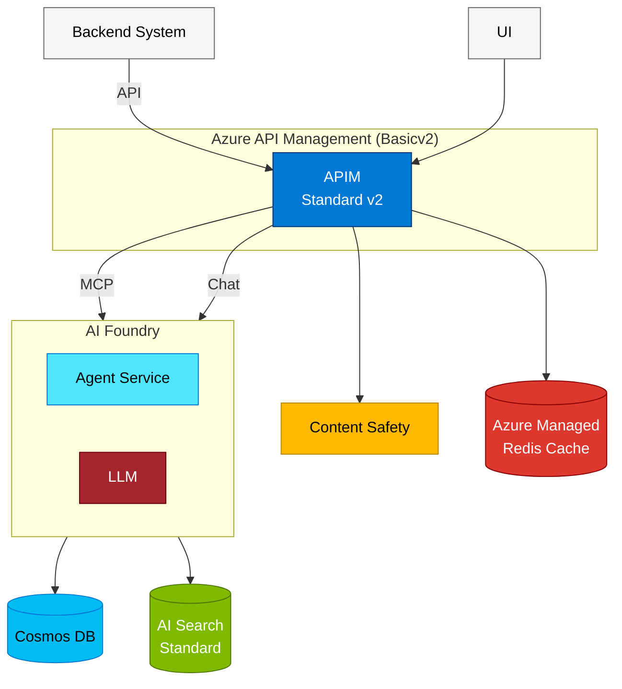

# Customer Solution Architecture

## Overview

This document outlines a comprehensive Azure-based AI solution architecture designed to provide intelligent, scalable, and secure services through a managed API gateway with multiple backend services.

## Architecture Components

### Frontend & API Management
- **Azure API Management (Basicv2)**: API gateway providing secure access, rate limiting, authentication, and request routing
  - Managed API endpoints
  - Service Principal/User Zone authentication
  - Request throttling and monitoring

### AI & Intelligence Layer
- **Azure AI Foundry**: Hub for AI model deployment and orchestration
  - LLM deployment for natural language processing
  - Model management and versioning
- **Azure Content Safety**: Content moderation and safety filtering
  - Text analysis and moderation
  - Safety policy enforcement

### Data & Search Services
- **Azure AI Search (Standard)**: Intelligent search capabilities
  - Full-text search
  - Vector search support
  - AI-powered indexing

- **Azure Cosmos DB**: NoSQL database for global distribution
  - Multi-region write capabilities
  - Low-latency data access
  - JSON document storage

- **Azure Managed Redis Cache**: High-performance in-memory cache
  - Session state management
  - Response caching
  - Real-time data access

### Application Services
- **MCP Agent Service**: Model Context Protocol agent orchestrating AI interactions
  - Request processing
  - Service coordination
  - Response aggregation

## Architecture Diagram

## Architecture Flow

### Request Processing Flow

1. **Client Request**
   - Client applications send API requests to Azure API Management endpoints

2. **API Gateway Processing**
   - APIM authenticates and validates incoming requests
   - Rate limiting and throttling applied
   - Request routed to appropriate backend service

3. **Agent Orchestration**
   - MCP Agent receives the validated request
   - Determines required services based on request type

4. **Service Integration**
   - **Content Safety**: Validates input for safety compliance
   - **Redis Cache**: Checks cache for existing results
   - **AI Foundry LLM**: Processes natural language requests
   - **AI Search**: Executes search queries across indexed content
   - **Cosmos DB**: Retrieves or persists data
   - **Content Safety**: Validates output before returning

5. **Response Delivery**
   - Agent aggregates results from various services
   - Response cached in Redis for future requests
   - Final response returned through APIM to client

## Key Features

### Scalability
- Horizontal scaling of agent services
- Auto-scaling capabilities across all Azure services
- Redis caching reduces database load

### Security
- API Management provides centralized security
- Service Principal authentication
- Content Safety ensures appropriate content filtering
- Network isolation through VNets (recommended)

### Performance
- Redis caching for low-latency responses
- AI Search for fast full-text and vector search
- Cosmos DB global distribution for regional performance
- APIM response caching

### AI Capabilities
- Advanced LLM processing through AI Foundry
- Intelligent search with AI Search
- Automated content moderation
- Vector similarity search support

## Deployment Considerations

### Cost Optimization
- **AI Search Standard**: Balanced performance for production workloads
- **APIM Basicv2**: Cost-effective API management with essential features
- **Redis Cache**: Right-size based on cache hit ratio analysis
- **Cosmos DB**: Use appropriate consistency level and request unit allocation

### High Availability
- Multi-region deployment for Cosmos DB
- APIM availability zones support
- Redis cache replication
- AI Foundry model redundancy

### Monitoring & Observability
- Application Insights integration
- APIM analytics and metrics
- Cosmos DB monitoring
- Custom dashboards for agent performance

## Recommended Next Steps

1. **Infrastructure as Code**: Deploy using Azure Verified Modules (AVM) with Bicep
2. **Network Security**: Implement VNet integration and Private Endpoints
3. **Identity Management**: Configure Azure AD integration and Managed Identities
4. **Monitoring Setup**: Configure Application Insights and alerting
5. **CI/CD Pipeline**: Establish deployment automation
6. **Load Testing**: Validate performance under expected load
7. **Disaster Recovery**: Implement backup and recovery procedures

## Azure Verified Modules (AVM) Resources

Consider using the following AVM modules for deployment:
- `avm/res/api-management/service` - API Management
- `avm/res/ai-services/foundry` - AI Foundry (if available)
- `avm/res/search/search-service` - AI Search
- `avm/res/document-db/database-account` - Cosmos DB
- `avm/res/cache/redis` - Redis Cache
- `avm/res/cognitive-services/account` - Content Safety

---

*Document Version: 1.0*  
*Last Updated: February 26, 2026*
