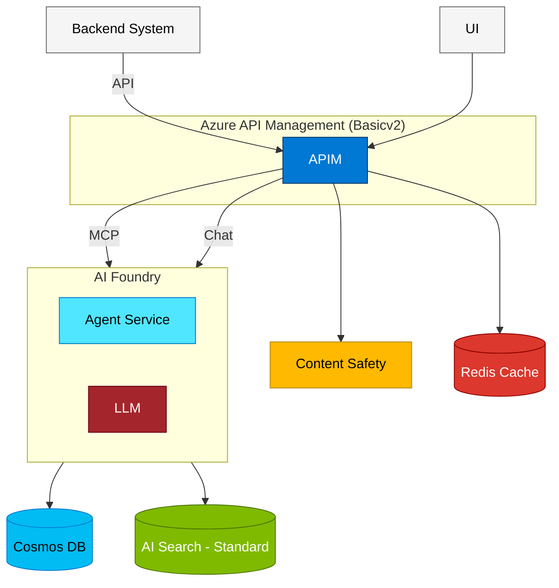

# Customer Solution Architecture

## Overview

This document outlines a comprehensive Azure-based AI solution architecture designed to provide intelligent, scalable, and secure services. Entry point is via **UI**, routing through Azure API Management. APIM handles content safety and caching directly, while AI Foundry orchestrates agent and LLM workloads that read and write from Cosmos DB and AI Search. **Backend System** (via API) is being wrapped with serverless MCP capabilities of APIM to be consumed by the **AI Foundry** agent

## Architecture Components

### Entry Points
- **Backend System**: Upstream backend services that offer the AI Foundry Agent with grounding data via a standard API interface into APIM
- **UI**: User-facing frontend that sends requests directly to APIM

### API Gateway
- **Azure API Management (Standardv2)**: Central gateway that routes all inbound traffic
  - Authenticates and validates requests from both Backend System and UI
  - Routes chat requests to AI Foundry via Chat protocol
  - APIM offers a serverless wrapper for the backend API as MCP server
  - Directly invokes Content Safety for input/output moderation
  - Directly manages Azure Managed Redis Cache for semantic caching

### AI Services
- **Azure AI Foundry**: Managed boundary hosting AI Agents
  - **Agent Service**: Orchestrates multi-step AI workflows with tooling via MCP
  - **LLM**: Handles chat and language model inference
  - Writes conversation history and results to Cosmos DB
  - Queries AI Search for retrieval-augmented generation (RAG - Fabric IQ)
- **Azure Content Safety**: Connected directly to APIM for request and response moderation
  - Text analysis and policy enforcement before and after AI processing

### Data & Storage Services
- **Azure AI Search (Standard)**: Receives queries from AI Foundry for semantic and vector search
  - Full-text and vector search support
  - AI-powered indexing for RAG scenarios

- **Azure Cosmos DB**: Receives read/write operations from AI Foundry
  - Stores conversation history, and agent state
  - Low-latency, globally distributed NoSQL storage

- **Azure Managed Redis Cache**: Connected directly to APIM for high-speed semantic caching
  - Response caching to reduce repeated LLM and backend calls
  - Session state management

## Architecture Diagram

## Architecture Flow

### Request Processing Flow

1. **Inbound Request**
   - **Backend System** sends API calls into APIM
   - **UI** sends user requests directly into APIM

2. **API Gateway Processing (APIM)**
   - Authenticates and validates all inbound requests
   - Runs **Content Safety** — blocks non-compliant requests before forwarding
   - Checks **Redis Cache** — returns cached response if available
   - Routes chat requests to **AI Foundry** Agent via Reponses API for LLM inference
   - Provides a wrapper for runtime dicoverability of the backend system via **MCP** enabling the agent invoke the backend as needed

3. **AI Foundry Processing**
   - **Agent Service** orchestrates multi-step workflows via MCP
   - **LLM** handles chat and inference requests
   - AI Foundry queries **AI Search** for relevant context (RAG)
   - AI Foundry reads/writes **Cosmos DB** for state, history, and data persistence

4. **Response Delivery**
   - AI Foundry returns results to APIM
   - APIM runs **Content Safety** on the response
   - APIM writes the response to **Redis Cache** for future reuse
   - Final response returned to the originating user via UI

## Key Features

### Scalability
- Horizontal scaling of agent services
- Auto-scaling capabilities across all Azure services
- Redis caching reduces database load

### Security
- APIM provides centralized authentication and policy enforcement for both Backend System and UI
- Content Safety is enforced at the APIM layer — applied to both inbound requests and outbound responses
- AI Foundry isolates agent and LLM workloads within a managed boundary
- Network isolation through VNets and Private Endpoints (recommended)

### Performance
- Redis Cache connected directly at the APIM layer for maximum cache hit efficiency before AI processing
- AI Search provides fast full-text and vector search for RAG workloads within AI Foundry
- Cosmos DB offers low-latency data access for agent state and conversation history
- APIM handles rate limiting and request throttling to protect downstream services

### AI Capabilities
- AI Foundry hosts both the Agent Service (workflow orchestration) and LLM (chat inference) within a single managed boundary
- Agent Service enables multi-step, tool-using AI workflows
- LLM supports natural language understanding and generation
- AI Search provides semantic and vector search to ground LLM responses in retrieved data (RAG)
- Content Safety enforced at the APIM layer protects all AI inputs and outputs

## Deployment Considerations

### Cost Optimization
- **AI Search Standard**: Balanced performance for production workloads
- **APIM Basicv2**: Cost-effective API management with essential features
- **Redis Cache**: Right-size based on cache hit ratio analysis
- **Cosmos DB**: Use appropriate consistency level and request unit allocation

### High Availability
- Multi-region deployment for Cosmos DB
- APIM availability zones support
- Redis cache replication
- AI Foundry model redundancy

### Monitoring & Observability
- Application Insights integration
- APIM analytics and metrics
- Cosmos DB monitoring
- Custom dashboards for agent performance

## Azure Verified Modules (AVM) Resources - Bicep

Consider using the following AVM modules for deployment:
- `avm/res/api-management/service` - API Management
- `avm/res/ai-services/foundry` - AI Foundry
- `avm/res/search/search-service` - AI Search
- `avm/res/document-db/database-account` - Cosmos DB
- `avm/res/cache/redis` - Redis Cache
- `avm/res/cognitive-services/account` - Content Safety

---

*Document Version: 1.0*  
*Last Updated: February 26, 2026*
